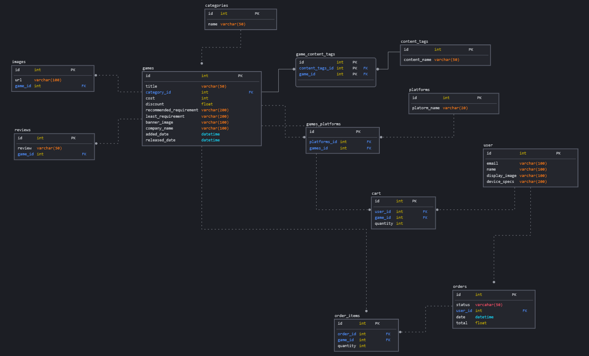

# The Merchant

## Summary

**Attention!!
Update: This website has changed from an e-commerce selling online games to an e-commerce selling military surplus. The context of this project has changed due to the lack of availability of free to use images which can help simulate an online game shop platform. Thank you!**

The purpose of this project is to create an online store to sell online games to avid gamers. There are two parts to the project, the backend and the frontend. The backend caters to the vendor who can manage the game product list and orders. The frontend caters to the general public, especially gamers who wish to buy online games. The cart system is implemented in order to facilitate easy browsing and buying of games. The checkout system is also implemented using Stripe to facilitate the transactions between the user and the vendor.

## Landing Page

 
This is the landing page where users can log in.
 

## Sign up Page

## Item List Page

## Item Details Page

## Cart

## Cart Checkout Page (Stripe)

## Cart Checkout Page Fail

## Cart Checkout Page Success

## Order History

## ERD Diagram

## SQLDBM Diagram

## Technology used

<ul>
	<li>Axios</li>
	    <ul>
		    <li>It is a technology used to give the program HTTP client capability</li>
			<li>Purpose: It used to make HTTP requests to APIs/URLs to retrieve data from the server</li>
			<li> https://github.com/axios/axios</li>
		</ul>
	<li>Bootstrap CSS</li>
	    <ul>
		    <li>A library which has pre-made css components</li>
			<li>Purpose: for fast building of CSS on websites</li>
			<li>https://getbootstrap.com/</li>
		</ul>
	<li>Google Fonts</li>
	    <ul>
			<li> Additional fonts for HTML</li>
			 <li>https://fonts.google.com/</li>
		</ul>
	<li>React</li>
		<ul>
			<li> Front end framework based on JS</li>
			<li>Purpose: A framework which uses state to manipulate frontend webpages</li>
			<li>https://reactjs.org/</li>
		</ul>
	<li>Mysql </li>
		<ul>
			<li> A relational database</li>
			<li>Purpose: The database behind the backend server to store data from users</li>
			<li>https://www.mysql.com/</li>
		</ul>
	<li>Nodejs </li>
		<ul>
			<li> It is a JS backend runtime environment</li>
			<li>Purpose: The basic building block for the backend server</li>
			<li>https://nodejs.org/en/</li>
		</ul>
	<li>Express</li>
		<ul>
			<li> A backend framework for node.js</li>
			<li>Purpose: to send and receive HTTP communications via the built-in GET, POST , PUT, etc</li>
			<li>https://expressjs.com/</li>
		</ul>
	<li>Cloudinary</li>
	<li>Stripe</li>
	<li>Express</li>  
	<li> HBS </li>
	<li>Wax-on</li>  
	<li>Dotenv</li>
	<li>Express-session</li> 
	<li>Connect-flash</li>
	<li>Session-file-store</li>
	<li>Csurf</li>
	<li>Jsonwebtoken</li>
	<li>React-router-dom@5.2.0</li>
</ul>

## Deployment
### Database
Remote Postgres server in Supabase database hosting website

### Environment Variables

Database: to intialise access to the remote database
<ul>
	<li>DB_DRIVER
	<li>DB_USER
	<li>DB_PASSWORD
	<li>DB_DATABASE
	<li>DB_HOST
	<li>DB_PORT
</ul>

Cloudinary: to initialise access to cloudinary account so that images can be uploaded and stored
<ul>
	<li>CLDNRY_NAME
	<li>CLDNRY_API_KEY
	<li>CLDNRY_API_SECRET
	<li>CLDNRY_UPLOAD_PRESET
</ul>

Stripe: variables to carry out transactions and redirects
<ul>
	<li>STRIPE_PUBLISHABLE_KEY
	<li>STRIPE_SECRET_KEY
	<li>STRIPE_SUCCESS_URL
	<li>STRIPE_ERROR_URL
	<li>STRIPE_ENDPOINT_KEY
</ul>

Sessions: A secret key to create sessions between client and servers
<ul>
	<li>SESSION_SECRET
</ul>

JWT tokens: Keys used for API communication. It needs to be refreshed with a new one every few moments in order to make the access token valid
<ul>
	<li>TOKEN_SECRET (Access Token)
	<li>REFRESH_TOKEN_SECRET (Refresh Token)
</ul>

## Credits

| Acknowledgements | Link |
|--|--|
|Axios| https://github.com/axios/axios|
|Bootstrap CSS|https://getbootstrap.com/|
|Google Fonts|https://fonts.google.com/|
|Express|https://expressjs.com/|
|NodeJS|https://nodejs.org/en/|
|React|https://reactjs.org/|
|Cloudinary|https://cloudinary.com/|
|Stripe|https://stripe.com/|
|React-router-dom@5.2.0|https://v5.reactrouter.com/web/guides/quick-start|
|HBS|https://www.npmjs.com/package/hbs|
|Wax-on|https://www.npmjs.com/package/wax-on|
|Dotenv|https://www.npmjs.com/package/dotenv|
|Express-session|https://www.npmjs.com/package/express-session|
|Connect-flash|https://www.npmjs.com/package/connect-flash|
|Session-file-store|https://www.npmjs.com/package/session-file-store|
|Csurf|http://expressjs.com/en/resources/middleware/csurf.html|
|Jsonwebtoken|https://www.npmjs.com/package/jsonwebtoken|

