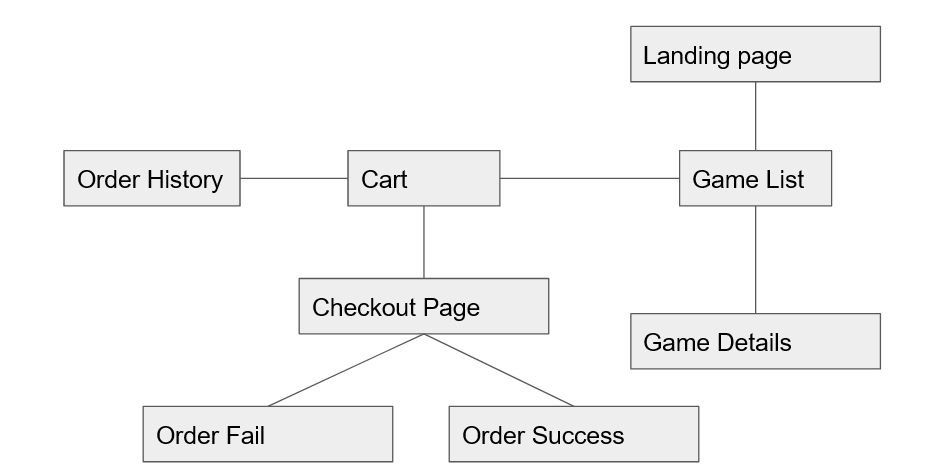
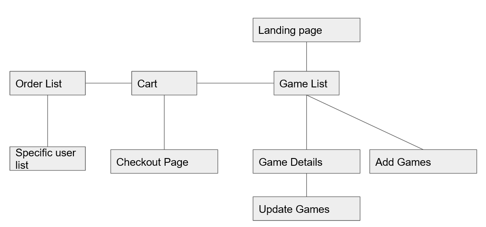

# The Merchant

## Summary

This project is where users can share their paranormal encounters with others, by uploading their encounter information and image of the paranormal on our website.

The purpose of this project is to create an online store to sell online games to avid gamers. There are two parts to the project, the backend and the frontend. The backend caters to the vendor who can manage the game product list and orders. The frontend caters to the general public, especially gamers who wish to buy online games. The cart system is implemented in order to facilitate easy browsing and buying of games. The checkout system is also implemented using Stripe to facilitate the transactions between the user and the vendor.

<ins>Organisation goals (vendor):</ins>
<ul>
	<li>Promote awareness of online games that are in the market</li>
	<li>Facilitate profit-making between the vendor and the customers</li>
	 <li> Easy selling of and advertising of games to encourage </li>
</ul>
	 
<ins>User goals (customers, especially gamers):</ins>
	<ul>
		<li> A one stop place to find different kind of games, ranging from PC to XBOX</li>
		<li> Easy search of games base on the kind of genre that sparks their interest</li>
		<li> Easy to browse through games and make comparisons for their device requirements in order to make fast decision to see if their machine is capable of running the game</li>
	</ul>

<ins>Motivation</ins>

This project takes inspiration from websites like Origin and Steam. They are however, not a local company. As a result, promotion and marketing events are not done locally. This project seeks to bring the online gaming market to the locals to make it easier to buy online games. This project seeks to establish a local brand name for the online gaming market and  a go-to place for Singaporeans to buy games.

In the 7 billion people that exists in the world, the number of people buys the product from Steam or Origin numbers only in the tens of thousands. This means that there is a huge market out there that local business are not really tapping on.

Based on this news, https://www.straitstimes.com/business/companies-markets/singapore-sets-sights-on-becoming-world-force-in-e-sports, this market would be a win for us.

<ins>The Merchant Link:</ins>
	<ul>
		<li></li>
	</ul>

## UI/UX 
### Stratergy
<ins>User Stories</ins>

As a customer I want to see a list of games so that I can select them easily

As a customer I want to see a game details so that I can see details of each games

As a customer I want to add the selected games into carts so that I can buy them later in the checkout

As a customer I want to remove selected games from cart so that I can reject paying them later
 
As a customer I want to update the selected games in carts so that I can change my game selections 

As a customer I want to checkout my cart so that I can proceed to payment page

As a customer I want to see the receipt so that I can get an evidence of the game that I have bought

 
As a vendor I want to add new games so that I can let customers choose

As a vendor I want to see a list of games so that I can access each games

As a vendor I want to see a game details so that I can see details of each games

As a vendor I want to update games so that I can change its details

As a vendor I want to delete games so that I can remove games

As a vendor I want to see orders so that I can keep records of transactions

<ins>Acceptance criteria</ins>
<ul>
	<li>Vendor can see edit delete and create games</li>
	<li>Vendor can see edit delete and create orders</li>
	<li>Vendor search through games</li>
	<li>Vendor search through orders</li>
	<li>Customers can see cart, add games to cart update quantity in cart and remove game from cart</li>
	<li>Customer can checkout to buy their games</li>
	<li>Customer can access their orders history</li>
	<li>Customer search through games</li>
	<li>Customer compare requirements</li>
</ul>

### Scope
<ins>Functional requirements</ins>

<ul>
	<li>Vendor</li>
	<ul>
		<li>Vendor can list games</li>
		<li>Vendor can see game details</li>
		<li>Vendor can add games to list</li>
		<li>Vendor can delete games from list</li>
		<li>Vendor can update games in list</li>
		<li>Vendor can list orders</li>
		<li>Vendor can search orders</li>
		<li>Vendor can search games</li>
	</ul>
	<li>Customers</li>
	<ul>
		<li>Customers can list games</li>
		<li>Customers can see game details</li>
		<li>Customers can add games to cart</li>
		<li>Customers can delete games from cart</li>
		<li>Customers can update game quantity in cart</li>
		<li>Customers can  do checkout</li>
		<li>Customers can get payment summary</li>
		<li>Customers can  list orders history</li>
	</ul>
</ul>

<ins>Non-functional requirements</ins>
<ul>
	<li>Mobile responsiveness: As the website will have many texts, a proper size and font is needed for mobile users to have ease of reading.</li>
	<li>Privacy</li>
	<li>Security</li>
	<li>Localization criteria: Only in English as this website is open to everyone</li>
	<li>Accessibility criteria: Only for those who are not visually impaired</li>	
	<li>Not Applicable: Performance</li>
</ul>

### Structure
Structure used:

Linear Network Hybrid

Customer:

Vendor:

Information organisation:

Information is organised in as concisely as possible, only highlighting the important points of a product. The only information that is long and elaborated will be zoned in an isolated location so that it will not interfere with the other information regarding the product. This applies to product description and the minimum/recommended requirements. The other information, like costs, discount and title will be as spaced out as possible to reduce clutter.

### Skeleton
<ins>Desktop Mockup</ins>

<ins>Mobile Mockup</ins>

### Surface

<ul>
	<li>Appearance</li>
		<ul>
			<li>Typography: </li>
				<ul>
				<li>Genos: For main titles because it is very eye-catching.</li>
				<li>Rajdhani: For contents. It looks easy on the eyes and modern. It has the "gaming" look.</li>
				</ul>
			<li>Color:</li>
				<ul>
				<li>rgba(255,255,255,0.4): Primary color. It is white and a bit transparent. This will help ease the eyes and to help users focus on the important information. </li>
				<li>Orange: Secondary color. To highlight important buttons so that the buttons will stand out more to the users.  </li>
				<li>Blue: To be used when hovering on clickable texts.</li>
				</ul>
			<li>Font Size:</li>
				<ul>
				<li>Big texts are to catch the users attention. Mostly used in titles. Smaller texts are used for the 			contents</li>
				<li>Font size varies, depend on the screen size to make the website responsive</li>
				</ul>
			<li>Layout:</li>
				<ul>
				<li>A lot of space are used between texts to ensure that it doesn't look cluttered. Users need to be given a calm mind in order to decide on the games that best fit their machine. We don't want users to buy games which they cannot run on their machines</li>
				</ul>
		</ul>
	<li>Mobile Requirement:</li>
		<ul>
				<li>This is achieved by starting from the mobile layout. The most important thing to keep track is the size of components, like words, icons etc. Because this will change when the website runs on a bigger screen, therefore the size of the components and the screens must be proportionate.</li>
	 </ul>
</ul>

## Features
### Feature List
