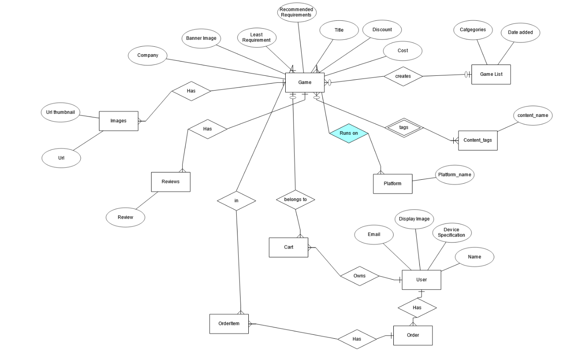

# The Merchant

## Summary

This project is where users can share their paranormal encounters with others, by uploading their encounter information and image of the paranormal on our website.

The purpose of this project is to create an online store to sell online games to avid gamers. There are two parts to the project, the backend and the frontend. The backend caters to the vendor who can manage the game product list and orders. The frontend caters to the general public, especially gamers who wish to buy online games. The cart system is implemented in order to facilitate easy browsing and buying of games. The checkout system is also implemented using Stripe to facilitate the transactions between the user and the vendor.

<ins>Organisation goals (vendor):</ins>
<ul>
	<li>Promote awareness of online games that are in the market</li>
	<li>Facilitate profit-making between the vendor and the customers</li>
	 <li> Easy selling of and advertising of games to encourage </li>
</ul>
	 
<ins>User goals (customers, especially gamers):</ins>
	<ul>
		<li> A one stop place to find different kind of games, ranging from PC to XBOX</li>
		<li> Easy search of games base on the kind of genre that sparks their interest</li>
		<li> Easy to browse through games and make comparisons for their device requirements in order to make fast decision to see if their machine is capable of running the game</li>
	</ul>

<ins>Motivation</ins>

This project takes inspiration from websites like Origin and Steam. They are however, not a local company. As a result, promotion and marketing events are not done locally. This project seeks to bring the online gaming market to the locals to make it easier to buy online games. This project seeks to establish a local brand name for the online gaming market and  a go-to place for Singaporeans to buy games.

In the 7 billion people that exists in the world, the number of people buys the product from Steam or Origin numbers only in the tens of thousands. This means that there is a huge market out there that local business are not really tapping on.

Based on this news, https://www.straitstimes.com/business/companies-markets/singapore-sets-sights-on-becoming-world-force-in-e-sports, this market would be a win for us.

<ins>The Merchant Link:</ins>
	<ul>
		<li></li>
	</ul>

## UI/UX 
### Stratergy
<ins>User Stories</ins>

As a customer I want to see a list of games so that I can select them easily

As a customer I want to see a game details so that I can see details of each games

As a customer I want to add the selected games into carts so that I can buy them later in the checkout

As a customer I want to remove selected games from cart so that I can reject paying them later
 
As a customer I want to update the selected games in carts so that I can change my game selections 

As a customer I want to checkout my cart so that I can proceed to payment page

As a customer I want to see the receipt so that I can get an evidence of the game that I have bought

 
As a vendor I want to add new games so that I can let customers choose

As a vendor I want to see a list of games so that I can access each games

As a vendor I want to see a game details so that I can see details of each games

As a vendor I want to update games so that I can change its details

As a vendor I want to delete games so that I can remove games

As a vendor I want to see orders so that I can keep records of transactions

<ins>Acceptance criteria</ins>
<ul>
	<li>Vendor can see edit delete and create games</li>
	<li>Vendor can see edit delete and create orders</li>
	<li>Vendor search through games</li>
	<li>Vendor search through orders</li>
	<li>Customers can see cart, add games to cart update quantity in cart and remove game from cart</li>
	<li>Customer can checkout to buy their games</li>
	<li>Customer can access their orders history</li>
	<li>Customer search through games</li>
	<li>Customer compare requirements</li>
</ul>

### Scope
<ins>Functional requirements</ins>

<ul>
	<li>Vendor</li>
	<ul>
		<li>Vendor can list games</li>
		<li>Vendor can see game details</li>
		<li>Vendor can add games to list</li>
		<li>Vendor can delete games from list</li>
		<li>Vendor can update games in list</li>
		<li>Vendor can list orders</li>
		<li>Vendor can search orders</li>
		<li>Vendor can search games</li>
	</ul>
	<li>Customers</li>
	<ul>
		<li>Customers can list games</li>
		<li>Customers can see game details</li>
		<li>Customers can add games to cart</li>
		<li>Customers can delete games from cart</li>
		<li>Customers can update game quantity in cart</li>
		<li>Customers can  do checkout</li>
		<li>Customers can get payment summary</li>
		<li>Customers can  list orders history</li>
	</ul>
</ul>

<ins>Non-functional requirements</ins>
<ul>
	<li>Mobile responsiveness: As the website will have many texts, a proper size and font is needed for mobile users to have ease of reading.</li>
	<li>Privacy</li>
	<li>Security</li>
	<li>Localization criteria: Only in English as this website is open to everyone</li>
	<li>Accessibility criteria: Only for those who are not visually impaired</li>	
	<li>Not Applicable: Performance</li>
</ul>

### Structure
Structure used:

Linear Network Hybrid

Customer:

Vendor:

Information organisation:

Information is organised in as concisely as possible, only highlighting the important points of a product. The only information that is long and elaborated will be zoned in an isolated location so that it will not interfere with the other information regarding the product. This applies to product description and the minimum/recommended requirements. The other information, like costs, discount and title will be as spaced out as possible to reduce clutter.

### Skeleton
<ins>Desktop Mockup</ins>

<ins>Mobile Mockup</ins>

### Surface

<ul>
	<li>Appearance</li>
		<ul>
			<li>Typography: </li>
				<ul>
				<li>Genos: For main titles because it is very eye-catching.</li>
				<li>Rajdhani: For contents. It looks easy on the eyes and modern. It has the "gaming" look.</li>
				</ul>
			<li>Color:</li>
				<ul>
				<li>rgba(255,255,255,0.4): Primary color. It is white and a bit transparent. This will help ease the eyes and to help users focus on the important information. </li>
				<li>Orange: Secondary color. To highlight important buttons so that the buttons will stand out more to the users.  </li>
				<li>Blue: To be used when hovering on clickable texts.</li>
				</ul>
			<li>Font Size:</li>
				<ul>
				<li>Big texts are to catch the users attention. Mostly used in titles. Smaller texts are used for the 			contents</li>
				<li>Font size varies, depend on the screen size to make the website responsive</li>
				</ul>
			<li>Layout:</li>
				<ul>
				<li>A lot of space are used between texts to ensure that it doesn't look cluttered. Users need to be given a calm mind in order to decide on the games that best fit their machine. We don't want users to buy games which they cannot run on their machines</li>
				</ul>
		</ul>
	<li>Mobile Requirement:</li>
		<ul>
				<li>This is achieved by starting from the mobile layout. The most important thing to keep track is the size of components, like words, icons etc. Because this will change when the website runs on a bigger screen, therefore the size of the components and the screens must be proportionate.</li>
	 </ul>
</ul>

Background Image:
Also, thanks for the beautiful image man!

(Photo by Miguel Á. Padriñán from Pexels)

## Features
### Feature List

Customer
<ul>
	<li> Login and signup</li>
	<li>List games, look at game details, both can add to cart </li>
	<li>Search and filter games</li>
	<li>Game details can show user specs vs game requirements</li>
	<li>Cart page to show what users have currently and can update quantity and remove item altogether</li>
	<li>Can do check out</li>
	<li>Shows "order fail" page if the checkout fail or if user goes back from Stripe page</li>
	<li>Show "order succes" page if the checkout is successful and will show the latest order </li>
	<li>List customer order history </li>
</ul>

Vendor
<ul>
	<li> Login and signup</li>
	<li>Add a new game, delete and update.</li>
	<li>List games, look at game details, both can add to cart </li>
	<li>Search and filter games</li>
	<li>Cart page to show what users have currently and can update quantity and remove item altogether</li>
	<li>Can do check out</li>
	<li>Shows "order fail" page if the checkout fail or if user goes back from Stripe page</li>
	<li>Show "order succes" page if the checkout is successful</li>
	<li>List all orders </li>
	<li>Search and filter orders</li>
</ul>

### ERD Diagram

### SQLDBM Diagram

### Feature Flow

Customer:

<ul>
	<li>Landing Page: Where customers can login or sign up </li>
	<li>Game List: The main place where customers can browse through a list of games and add to cart</li>
	<li>Game Details:  Customers can explore more about a game and also add to cart</li>
	<li>Order History: List the customers history</li>
	<li>Cart: Where customers can update the quantity and also remove items form cart. Customers can also do checkout</li>
		<li>Checkout: will redirect customers to Stripe page </li>
		<li>Order Success: If the transaction was successful, the user will be brought back to this page, showing the latest order </li>
		<li>Order Fail: If the transaction fail, the user will be brought back to this page</li>
</ul>

Vendor:

<ul>
	<li>Landing Page: Where vendors can login or sign up </li>
	<li>Game List: The place where vendors can manage games and test add to cart and checkout.</li>
	<li>Add Games: The main place where vendors can add games which will appear on customer front end.</li>
	<li>Game Details:  Vendors can look through the game details and can update and delete certain games</li>
	<li>Cart: Where vendors can update the quantity and also remove items form cart to test cart.</li>
	<li>Checkout: will redirect vendors to Stripe page to test checkout </li>
	<li>Order List: List all customer order history</li>	
</ul>

### Future Implementations
<ul>
	<li>Comments posted by customer for each games</li>
	<li>Product rating system</li>
	<li>Special Discount page</li>
</ul>

## Technology used

<ul>
	<li>Axios</li>
	    <ul>
		    <li>It is a technology used to give the program HTTP client capability</li>
			<li>Purpose: It used to make HTTP requests to APIs/URLs to retrieve data from the server</li>
			<li> https://github.com/axios/axios</li>
		</ul>
	<li>Bootstrap CSS</li>
	    <ul>
		    <li>A library which has pre-made css components</li>
			<li>Purpose: for fast building of CSS on websites</li>
			<li>https://getbootstrap.com/</li>
		</ul>
	<li>Google Fonts</li>
	    <ul>
			<li> Additional fonts for HTML</li>
			 <li>https://fonts.google.com/</li>
		</ul>
	<li>React</li>
		<ul>
			<li> Front end framework based on JS</li>
			<li>Purpose: A framework which uses state to manipulate frontend webpages</li>
			<li>https://reactjs.org/</li>
		</ul>
	<li>Mysql </li>
		<ul>
			<li> A relational database</li>
			<li>Purpose: The database behind the backend server to store data from users</li>
			<li>https://www.mysql.com/</li>
		</ul>
	<li>Nodejs </li>
		<ul>
			<li> It is a JS backend runtime environment</li>
			<li>Purpose: The basic building block for the backend server</li>
			<li>https://nodejs.org/en/</li>
		</ul>
	<li>Express</li>
		<ul>
			<li> A backend framework for node.js</li>
			<li>Purpose: to send and receive HTTP communications via the built-in GET, POST , PUT, etc</li>
			<li>https://expressjs.com/</li>
		</ul>
	<li>Cloudinary</li>
	<li>Stripe</li>
	<li>Express</li>  
	<li> HBS </li>
	<li>Wax-on</li>  
	<li>Dotenv</li>
	<li>Express-session</li> 
	<li>Connect-flash</li>
	<li>Session-file-store</li>
	<li>Csurf</li>
	<li>Jsonwebtoken</li>
	<li>React-router-dom@5.2.0</li>
</ul>

## Tests

| Test Case # | Test Case Description |Test Steps|Expected Result|
|--|--|--|--|
|1|User accesses the main URL|1. Go to URL (under Summary section)|A list of cases will appear in the Cases List page|
|2|User looks into Case Details|1. From the Cases List page, click on "Continue" button on one of the cases|Case details will appear showing at least on encounter and comments if available.|
|3|User wants to edit a Case|1.  From the Cases List page, click on "Continue" button on one of the cases 2. Click on "Edit" button. Edit page will appear and change the case title to "A haunting" 3. Click on the "Submit!" button.|The website will bring user back to the Case Details page with a change to the Case title|
|4|User wants to delete a Case|1.  From the Cases List page, click on "Continue" button on one of the cases 2. Click on "Delete" button 3. A prompt will appear above. Click on "Confirm!" |The  Website will bring the user to the  Cases List page|
|5|User wants to add a Case|1. Click on "Add Case" button on the side nav bar. Fill up the form -> Display Name: Bob, Occupation:Engineer, Age:30, Paranormal Encounter: <can be empty>, email address: test@gmail.com, title:A haunting, description:Scary house, Location: Creepy house, date:23/3/2021, Activity: Accidental, Entity Tags: Pocong, Pontianak. Fill up form for Encounter as well -> Image:https://images.unsplash.com/photo-1593642632559...., Description: This is a picture, Equipment Used: Phone Camera, Contact Type: Visual, Number of entities encountered:1, Time of Encounter: Morning 2. Click on "Add!" 3. Click on "Submit!"|The website will bring user back to the Cases List page with a new Case at the bottom of the list|
|6|User wants to post comment|1. From the Cases List page, click on "Continue" button on one of the cases. Scroll down to the "Comments" section, enter in the textbox: This is very scary! 2. Click on "Add!"|A popup box in green will appear saying that "Comment Added"|
|7|User wants to edit comment|1. From the Cases List page, click on "Continue" button on one of the cases. Scroll down to the "Comments" section. 2. Click on "Edit" on the comment added earlier, enter in the textbox: This is not so scary! 3. Click on "Done!"|A popup box in green will appear saying that "Comment Edited" and the earlier added comment has been changed|
|8|User wants to delete comment|1. From the Cases List page, click on "Continue" button on one of the cases. Scroll down to the "Comments" section. 2. Click on "Delete" on an available comment|A popup box in green will appear saying that "Comment Deleted"|
|9|User wants to search cases|1.Click on "Search Cases" button on the side nav bar. For the Entity tag, select Pontianak, then select the dates 2. Click on "Search". A list of cases will be returned to user. 3. Click on the "Continue" button on one of the searched cases|The website will return a list of cases and user can choose which cases he want to look into by clicking on the "Continue" buttons on one of the cases.|
||Prerequisite: Needs to be in Edit Case page or Add Case page|||
|10|User wants to add an Encounter|1. Scroll down to Add an Encounter section. Fill the form -> Image:https://images.unsplash.com/photo-1593642632559...., Description: This is a picture, Equipment Used: Phone Camera, Contact Type: Visual, Number of entities encountered:1, Time of Encounter: Morning 2. Click on "Add!" 3. Click on "Submit!"|The website will bring user back to the Case Details page with a new Encounter|
|11|User wants to edit an Encounter|1. Scroll down to Encounter Details section and click on "Edit" on one of the encounters. 2.Change the Description to "This is a scary place". Click on "Done!" 3. Click on "Submit!"|The website will bring the user back to the Case Details page with a change in the Descripton of and Encounter|
|12|User wants to delete an Encounter|1. Scroll down to Encounter Details section and click on "delete" on one of the encounters. 2.Click on "Submit!"|The website will bring the user back to the Case Details page with the deleted Encounter removed|

## Deployment
### Backend
Heroku

### Frontend
Netlify

## Credits

| Acknowledgements | Link |
|--|--|
|Axios| https://github.com/axios/axios|
|Bootstrap CSS|https://getbootstrap.com/|
|Google Fonts|https://fonts.google.com/|
|Express|https://expressjs.com/|
|NodeJS|https://nodejs.org/en/|
|React|https://reactjs.org/|
|Background Image|https://www.pexels.com/@padrinan|
|Cloudinary|https://cloudinary.com/|
|Stripe|https://stripe.com/|
|React-router-dom@5.2.0|https://v5.reactrouter.com/web/guides/quick-start|
|HBS|https://www.npmjs.com/package/hbs|
|Wax-on|https://www.npmjs.com/package/wax-on|
|Dotenv|https://www.npmjs.com/package/dotenv|
|Express-session|https://www.npmjs.com/package/express-session|
|Connect-flash|https://www.npmjs.com/package/connect-flash|
|Session-file-store|https://www.npmjs.com/package/session-file-store|
|Csurf|http://expressjs.com/en/resources/middleware/csurf.html|
|Jsonwebtoken|https://www.npmjs.com/package/jsonwebtoken|

